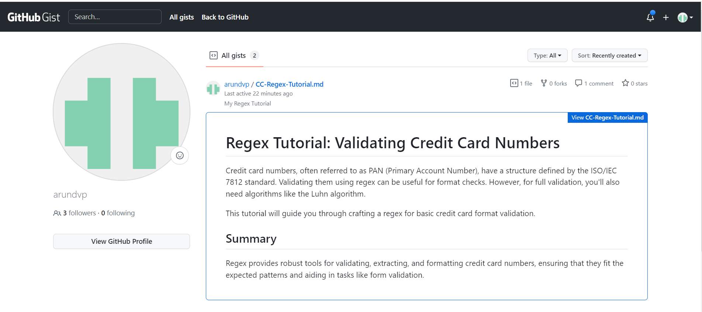
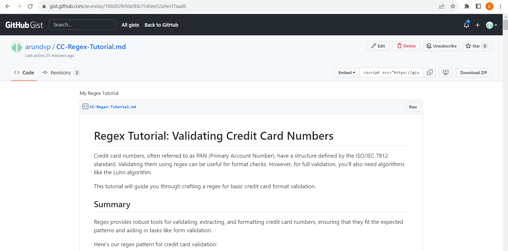

# Regex in JavaScript: A Comprehensive Tutorial by Arun Ayyasamy
  

 ## Description

In this Regex Tutorial, we delve into the intricacies of credit card number validation using regular expressions. The primary regex spotlighted here: `^(\d{4})([ -])(\d{4})\2(\d{4})\2(\d{4})$`, ensures consistent delimiter usage across 16-digit credit card numbers. This guide meticulously dissects and elucidates each segment of the regex, making the validation logic more accessible and transparent. By the end of this tutorial, you'll have a profound understanding of how this regex operates to authenticate and verify the input of legitimate credit card numbers.

**Credit Card Regex Overview**:

Using regex for credit card number management ensures:
- **Validation**: Checks if card numbers fit a standard format, e.g., `1234-5678-9012-3456` or undelimited.
- **Consistency**: Ensures uniform delimiters (spaces/dashes) using back-references.
- **Flexibility**: Handles multiple card formats with OR operators and quantifiers.
- **Usage**: Primarily for website form validation and data cleanup.
- **Caution**: Real credit card details must always be treated securely.

In essence, regex offers a precise way to handle, validate, and format credit card numbers across various digital platforms.

  ## Table of Contents
  - [Overview](#overview)
  - [Usage](#usage)
  - [License](#license)
  - [Deployed Link](#deployed-link)
  - [Snapshots](#sample-application)
  - [Questions](#questions)

  ## Overview 

**The Challenge**:

In this undertaking, task is to harness the wisdom gleaned from our tutorial, channeling it into a comprehensive guide centered on credit card number validation using regex. The roadmap to our accomplishment unfurls as follows:

1. **Deep Dive into Credit Card Structures**: Initiated our quest with a profound exploration of the diverse structures and formats inherent to credit card numbers.
2. **Deciphering Essential Components**: With insights from authoritative, peer-reviewed references, we distilled the crucial elements intrinsic to valid credit card numbers.
3. **Tailoring the Regex**: Leveraging this newfound knowledge, a regex pattern was meticulously crafted to ensure the robust validation of credit card numbers, in alignment with the highlighted components.
4. **Birth of the GitHub Gist**: Transitioned next to framing a GitHub Gist, adhering diligently to the directives encompassed in the "Installation Process".
5. **Demystifying the Regex**: Within this Gist's realm, we painted a vivid description, deconstructing the regex pattern earmarked for credit card validation. Each segment was illuminated, underscoring its significance in the overarching validation tapestry. Our elucidation, fortified by academic discourse, was shaped with novices and scholarly aficionados in mind.
6. **Synergy in Collaboration**: Amplifying our understanding, we cast our Gist link into the community's domain, igniting dialogues and amplifying our collective regex acumen.

**Reference documents**

1. **Credit Card Regex Test on Regex101**:
   - **Overview**: Regex101 allows users to share regex patterns. This specific link showcases a regex pattern designed for credit card validation.
   - **URL**: [Regex101 Credit Card Example](https://regex101.com/r/cO8lqs/9)

2. **Credit Card Validator Tool**:
   - **Overview**: This tool not only uses regex to validate the credit card number format but also checks for certain known patterns and provides a breakdown of the card type.
   - **URL**: [FreeFormatter Credit Card Validator](https://www.freeformatter.com/credit-card-number-generator-validator.html)

3. **Stack Overflow Discussions**:
   - **Overview**: Stack Overflow often has regex-based solutions for specific problems. Here's a link to a discussion about creating a regex for credit card validation.
   - **URL**: [Stack Overflow - Regex to validate credit card numbers](https://stackoverflow.com/questions/9315647/regex-credit-card-number-tests)

4. **Regular-Expressions.info Credit Card Example**:
   - **Overview**: This resource gives a basic understanding of how credit card regex can be formulated.
   - **URL**: [Regular-Expressions.info](https://www.regular-expressions.info/creditcard.html)

## Usage 

In the context of the credit card validation regex:

**Usage** refers to the practical application of the regex pattern in real-world scenarios, ensuring that credit card numbers entered into systems conform to the accepted standards and structures. 

**Key Points of Usage**:

1. **Form Validation**: One of the primary uses of the credit card regex pattern is in online forms where users enter their card details. This ensures that the users provide numbers in an expected format, reducing errors during payment processing.

2. **Data Cleaning**: If you're dealing with a database or a dataset containing credit card numbers, the regex pattern can be employed to identify and clean data entries that do not match the standard credit card format.

3. **Security**: A valid regex pattern can act as the first line of defense to prevent potential malicious inputs. Before further processing or storing the credit card numbers, a quick regex validation can filter out suspicious entries.

4. **Feedback to Users**: Using regex validations on client-side interfaces (like web forms) can provide instant feedback to users, guiding them to correct their input before submission. This enhances user experience and reduces the number of failed transactions.

5. **Data Extraction**: In instances where credit card numbers are embedded within larger text bodies, a regex pattern can be used to extract these numbers efficiently.

6. **Integration into Software**: Developers can incorporate this regex pattern into applications, software, or systems that handle credit card transactions or storage, ensuring that only valid formats are processed.

  ## License 
  This project is licensed under the MIT license.
  https://opensource.org/licenses/MIT

  ## Deployed Link 
    
  Github gist Link [Click Here](https://gist.github.com/arundvp/188d92fefda9bb7546ee52a9ecf7aad6)

  ## Snapshots 

  
  

  ## Questions 
  If you have any questions, please contact me at arun@arun.com.

  My GitHub profile is [arundvp](https://github.com/arundvp).
